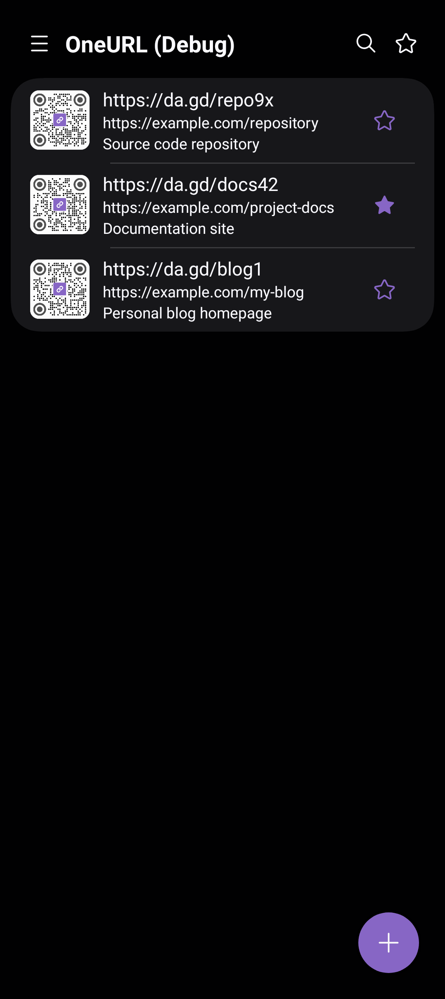
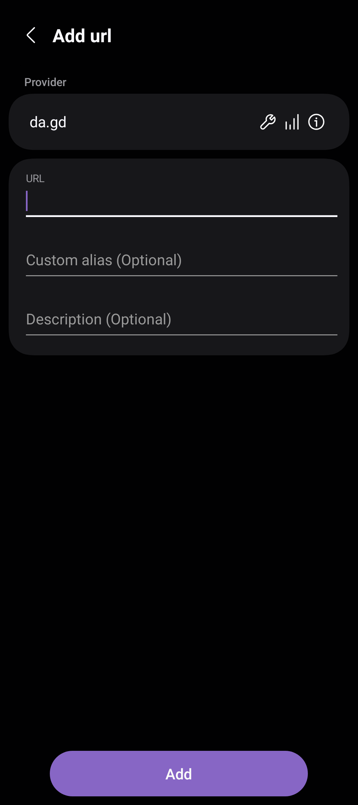
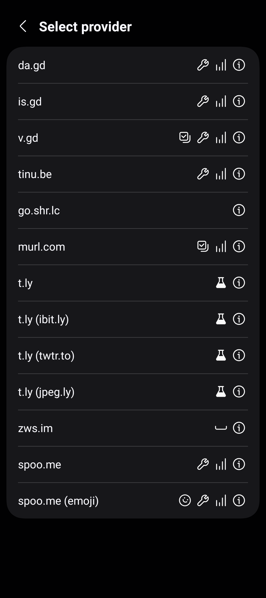
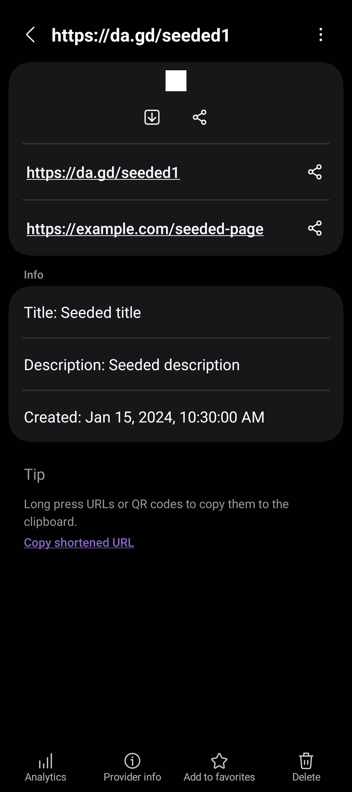
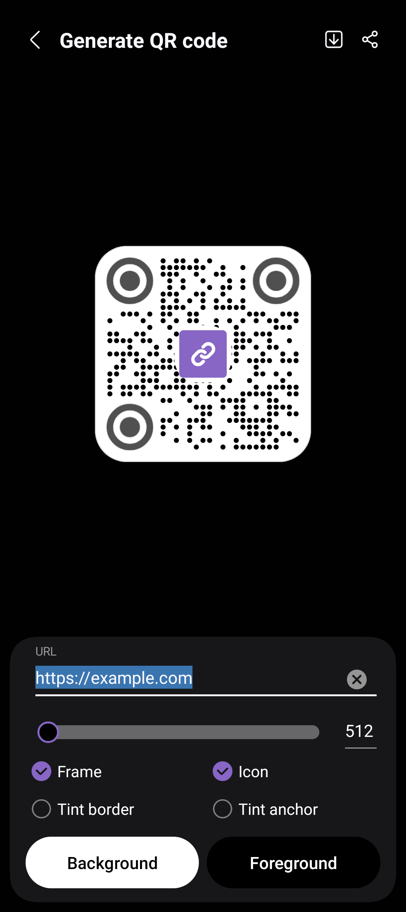
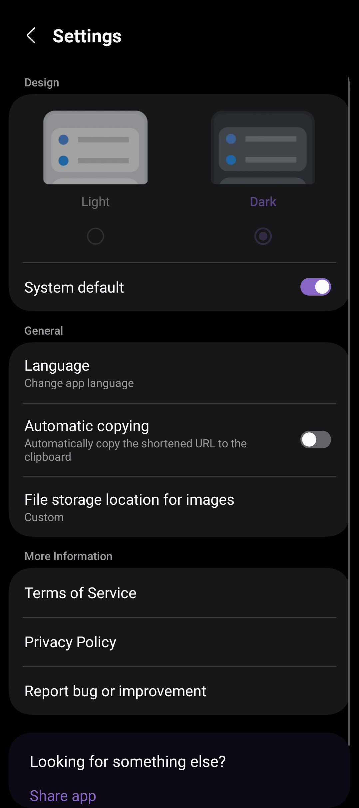

<!--suppress HtmlDeprecatedAttribute CheckImageSize-->

# OneURL

A URL-Shortener with OneUI-Design.

## More Information: <a target="_blank" href='https://www.leonard-lemke.com/apps/oneurl'>www.leonard-lemke.com </a>

 

 

 

<a href="https://www.star-history.com/?repos=Lemkinator%2FOneURL&type=date&legend=top-left">
 <picture>
   <source media="(prefers-color-scheme: dark)" srcset="https://api.star-history.com/chart?repos=Lemkinator/OneURL&type=date&theme=dark&legend=top-left" />
   <source media="(prefers-color-scheme: light)" srcset="https://api.star-history.com/chart?repos=Lemkinator/OneURL&type=date&legend=top-left" />
   
 </picture>
</a>

