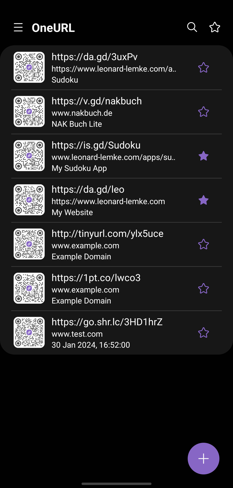
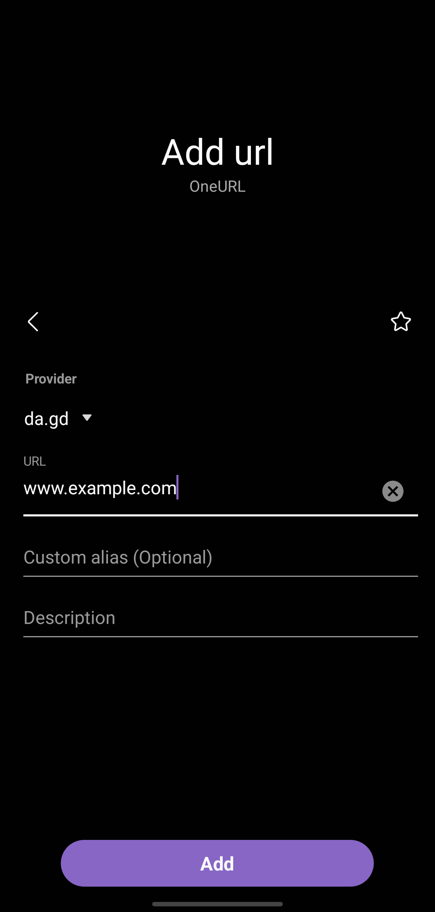
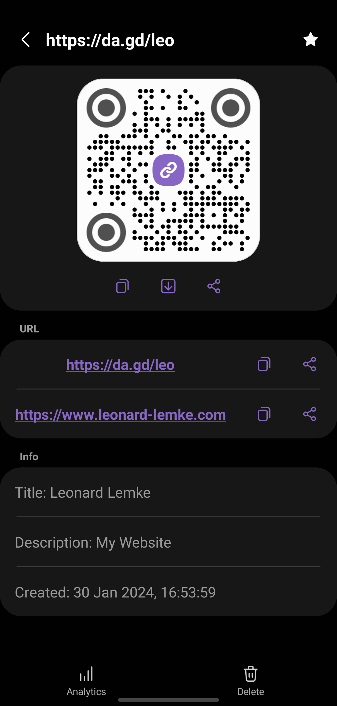
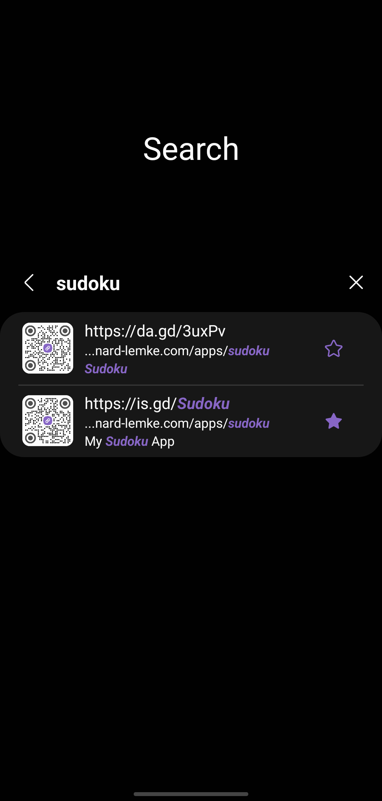

<!--suppress HtmlDeprecatedAttribute CheckImageSize-->

# OneURL

A URL-Shortener with OneUI-Design.

## More Information: <a target="_blank" href='https://www.leonard-lemke.com/apps/oneurl'>www.leonard-lemke.com </a>

 

 

<picture>
    <!--suppress HtmlUnknownTarget -->
    <source media="(prefers-color-scheme: dark)" srcset="https://api.star-history.com/svg?repos=Lemkinator/OneURL&type=Date&theme=dark" />
    
</picture>

